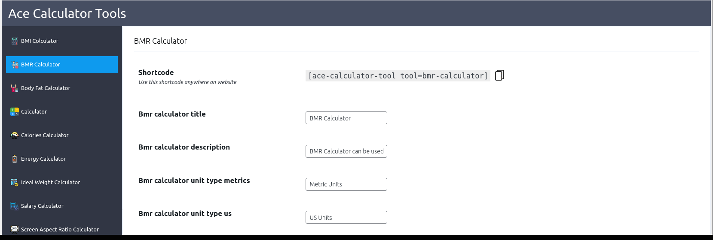
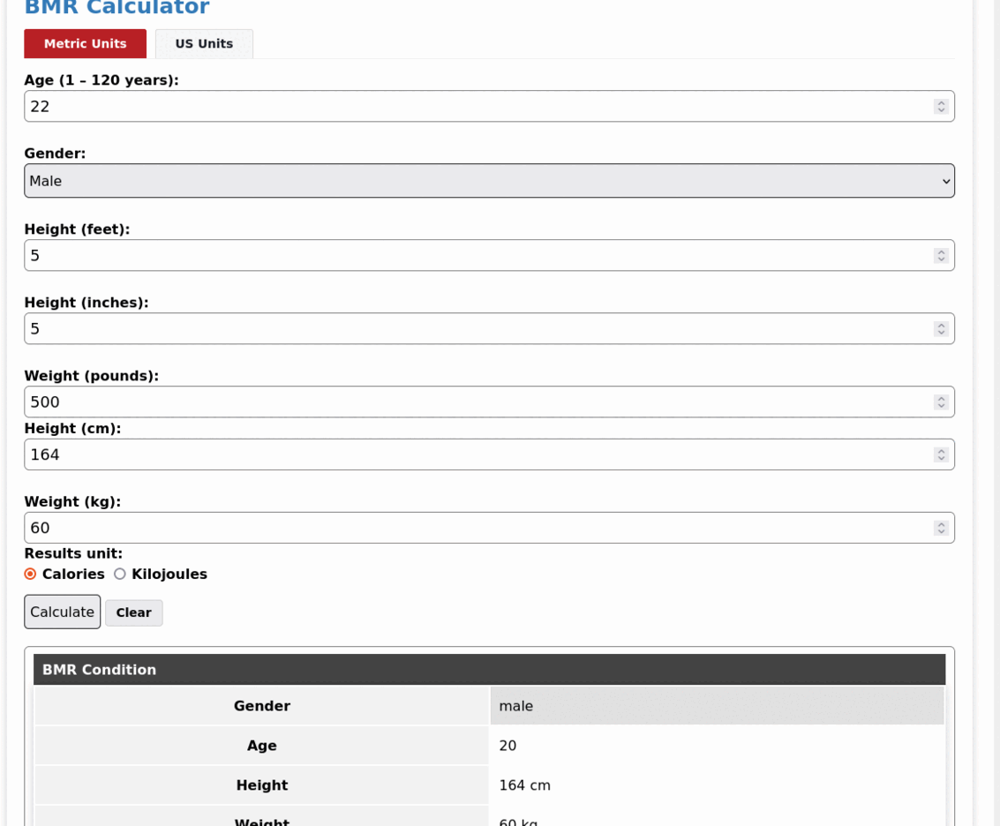

# Ace Calculator Tools

Comprehensive suite featuring a BMI Calculator, BMR Calculator, Body Fat Calculator, Calorie Calculator, Energy Calculator, Ideal Weight Calculator, Salary Calculator, and Screen Aspect Ratio Calculator. Ideal for health enthusiasts and financial planners alike, Ace Calculator Tools simplifies health assessments, fitness goals, diet planning, financial management, and design projects. 

A versatile toolset encapsulated in one plugin, Ace Calculator Tools offers efficiency and convenience in just a few clicks, making it your go-to solution for a myriad of calculations, from personal fitness journeys to financial planning and beyond. Streamline your calculations with Ace Calculator Tools for an all-encompassing experience.

### ⚡️ FEATURES
> * Instantly determine Body Mass Index for effective weight management.
> * Calculate Basal Metabolic Rate for personalized nutrition and fitness plans.
> * Accurately estimate body fat percentage for health and fitness tracking.
> * Plan diets with precision by calculating calorie needs based on activity levels.
> * Determine energy consumption for optimizing daily routines and lifestyle.
> * Set achievable weight goals with personalized ideal weight calculations.
> * Efficiently manage finances with net pay, deductions, and financial metrics.
> * Compute aspect ratios for seamless design and content display across devices.

 
### Installation
1. Navigate to the **“Plugins”** menu in WordPress.
1. Search for the **“Ace Calculator Tools”**.
1. Click the **“Install”** button.
1. Once installed, click the **“Activate”** button to activate the plugin.
1. After activation, you will find a menu named "Ace Calculator tools." Simply take any shortcode from that menu and place it in any page or post.

### Preview Backend

### Preview Frontend
